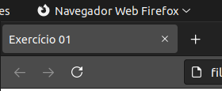
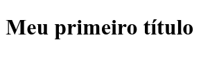
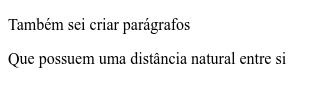
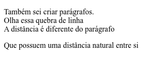
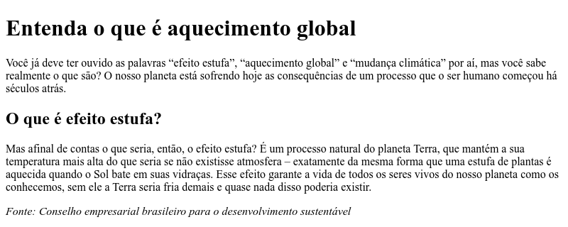
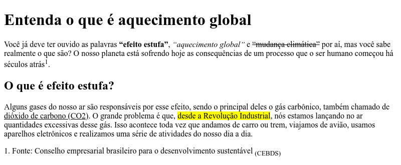
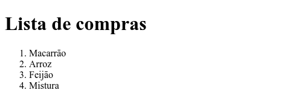
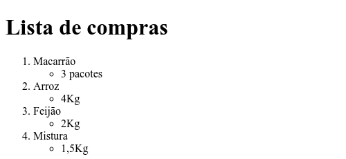

# Lista de exercícios de HTML

Esta lista de exercícios é parte integrante da disciplina, para o estudo do HTML5

1. Crie um documento HTML com o título (da barra de navegação) Exercício 01.
   
   
2. Agora utilize a tag para título, como no exemplo abaixo.
   
   
3. Crie parágrafos

   
4. Dentro de um parágrafo, crie uma quebra de linha.

   
5. Carregue alguma imagem no corpo da página

   
6. Faça um exemplo utilizando a hierarquia de títulos.

   
7. Consegue utilizar o negrito, itálico, sublinhado, sobrescrito, subscrito, taxado e destaque?

   
8. Crie uma lista ordenada

   
9.  E uma não ordenada também! 
  
    

10. Crie uma lista ordenada com subitens não ordenados.

    