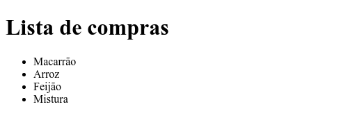
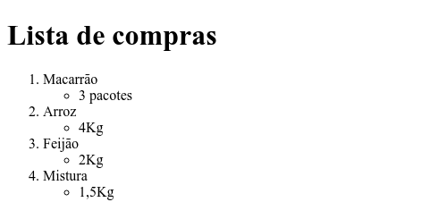

# Lista de exercícios de HTML/CSS

Para cada um dos exercícios, deverá criar um novo arquivo. Para o exercício 1, crie o arquivo 01.html, para o segundo, crie o arquivo 02.html e assim por diante. Quando terminar todos os exercícios, compacte (.zip, .rar, .7z, .gz, etc.) e anexe na atividade do Classroom.

## Exercícios de HTML

1. Crie um documento HTML com o título (da barra de navegação) Exercício 01;
   
   
2. Agora utilize a tag para título, como no exemplo abaixo;
   
   
3. Crie parágrafos;

   
4. Dentro de um parágrafo, crie uma quebra de linha;

   
5. Carregue alguma imagem no corpo da página;

   
6. Faça um exemplo utilizando a hierarquia de títulos;

   
7. Consegue utilizar o negrito, itálico, sublinhado, sobrescrito, subscrito, taxado e destaque?

   
8. Crie uma lista ordenada;

   
9.  E uma não ordenada também!
  
    

10. Crie uma lista ordenada com subitens não ordenados;

    
    
## Exercícios de formatação com CSS (HTML também é importante!)
11. Mude a cor de fundo da página (escolha uma cor diferente da cor padrão);

    
12. Crie uma tabela com três linhas e duas colunas, preencha com os valores da imagem e formate a cor do texto (não o título) com qualquer tonalidade de verde. As células do título devem ser feitas usando o `<th>...</th>` ([Veja dica](https://www.homehost.com.br/blog/criar-sites/tabela-html/));

    
13. Na tabela do exercício anterior, acrescente uma borda preta;

    
14. Agora tente fazer com que essa borda seja ao redor das células do conteúdo da tabela;

    
15. Agora, sem escrever um novo bloco CSS (deve aproveitar o que já existe), aplique a mesma formatação (de cor e borda) no título das colunas;

    
16. Usando classes (pesquise sobre), consiga a formatação a seguir, repare que as cores são diferentes para a as tabelas;

    
17. Que tal criar um título com uma fonte diferente? Pesquise uma fonte no Google fonts e mude todos os H1 da página para este fonte;

    
18. Crie um formulário que não precisa de *labels* (use o atributo *placeholder*) para uma autenticação. A borda dos campos deve ser algum tom de laranja, mas quando o usuário estiver fazendo uso do campo, mudar a cor de fundo para azul ([Veja dica](https://developer.mozilla.org/pt-BR/docs/Web/CSS/:focus));

    
19. Crie um formulário de cadastro, para os rótulos use a tag `<label>`, mas precisará mudar o comportamento padrão da exibição dos `<label>` e `<input>`, mude o display para que exiba um abaixo do outro. Atenção, essa quebra **NÃO DEVE SER FEITA ATRAVÉS DO HTML, portanto, nada de ` `** ([Veja dica](https://www.maujor.com/tutorial/propriedade-css-display.php));

    
20. Faça o mesmo que o anterior, mas acrescente dois `radio` para o usuário escolher a geração dele. Também faça ajustes no seu CSS (tanto no HTML quanto no CSS) para que neste caso não aconteça a quebra de linha entre o rótulo e o `radio`, **` ` é proibido** (Dica: acrescente os elementos dentro de um `
` e aplique um display diferente para esses elementos)

    
21. Sem utilizar a formatação por classe (nem id), aplique coloração alternada entre as linhas de uma tabela ([Veja dica](https://developer.mozilla.org/pt-BR/docs/Web/CSS/:nth-child));

    